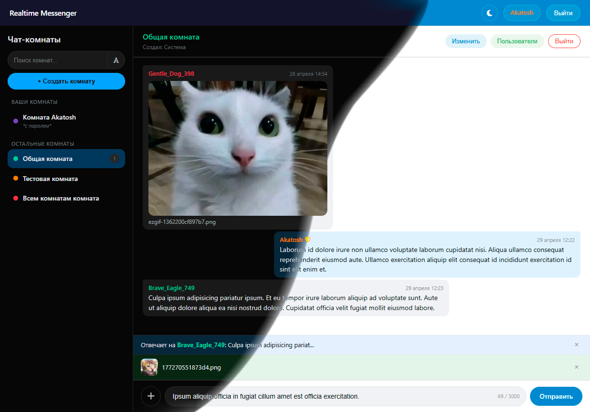
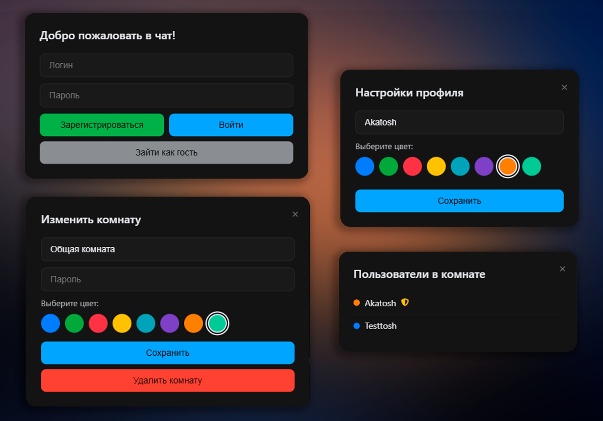

<div align="center">

# A-One-Chat

Многопользовательский веб-чат в реальном времени

</div>



## Описание предметной области и функциональности

Разработка многопользовательского веб-чата, обеспечивающего обмен текстовыми сообщениями и файлами в реальном времени. Пользователи могут создавать тематические комнаты, защищать их паролями, обмениваться сообщениями с возможностью ответов, а также загружать изображения, видео, аудио и документы. Администраторы имеют возможность удалять сообщения и управлять комнатами.

Ключевая техническая особенность - использование WebSocket-соединений для мгновенной доставки сообщений и система транзакций для обеспечения целостности данных при конкурентном доступе. Система поддерживает как авторизованных пользователей (с регистрацией и входом), так и гостевой доступ.<br><br>



### Ключевые функциональные сценарии (Use Cases):

- **Аутентификация пользователей:** Регистрация нового пользователя, вход по логину/паролю, гостевой доступ с автоматической генерацией ника и цвета, хранение токена в localStorage/sessionStorage.
- **Управление комнатами:** Создание комнат с настраиваемым цветом и опциональным паролем. Редактирование названия, цвета и пароля комнаты. Удаление комнаты (доступно создателю или администратору).
- **Интерактивный чат:** Отправка и получение текстовых сообщений в реальном времени через WebSocket. Поддержка системы ответов на сообщения с цитированием исходного текста.
- **Обмен файлами:** Загрузка и отправка файлов (изображения, видео, аудио, документы) с валидацией по расширению, MIME-типу и размеру (до 50 МБ). Предпросмотр прикреплённого файла перед отправкой.
- **Поиск комнат:** Фильтрация комнат по названию или по имени создателя с переключением режимов поиска.
- **Администрирование:** Удаление любых сообщений администратором с автоматическим обновлением цитат на удалённые сообщения.
- **Персонализация:** Изменение ника и цвета пользователя, выбор светлой или тёмной темы оформления с сохранением выбора.
- **Адаптивный интерфейс:** Поддержка мобильных устройств с бургер-меню для левой панели комнат.

## Технологический стек и инструментарий

| Категория | Конкретные инструменты и технологии |
|:---|:---|
| **Фронтенд (Frontend)** | **Ядро:** HTML5, CSS3 (CSS-переменные для тем), JavaScript (ES6+). **WebSocket API:** нативная поддержка браузеров. **Генерация DOM:** динамическое создание элементов через JS. **Адаптивность:** медиа-запросы для десктопной и мобильной версий. |
| **Бэкенд (Backend)** | **Фреймворк:** FastAPI (асинхронный). **WebSocket:** встроенная поддержка с кастомным `ConnectionManager`. **Безопасность:** кастомный `SecurityHeadersMiddleware` (CSP, X-Frame-Options, X-XSS-Protection), CORS middleware. **Статика и шаблоны:** Jinja2Templates, StaticFiles. |
| **База данных и ORM** | **СУБД:** SQLite3 (with WAL-mode). **Индексы:** на токенах авторизации, комнатах, сообщениях. **Транзакции:** через стандартные механизмы SQLite. |
| **Управление соединениями** | Кастомный `ConnectionManager` с поддержкой комнат, IP-лимитами (не более 5 соединений на IP), автоматической очисткой мёртвых подключений, реконнектом с экспоненциальной задержкой. |
| **Валидация файлов** | Библиотека `python-magic` для определения MIME-типа, проверка расширений и размера. |
| **Генерация токенов** | `secrets.token_hex(32)` для криптографически безопасных токенов. |
| **Санитизация данных** | HTML-эскейпинг, удаление `javascript:` ссылок и обработчиков событий. |
| **Rate Limiting** | Кастомные ограничители: 20 сообщений за 60 секунд (мин. интервал 1 сек), 5 попыток ввода пароля за 60 секунд. |
| **Тестирование** | pytest (80 тестов, 100% проходимость), логирование через `logging` (успешные/неудачные входы, подозрительная активность, ошибки WebSocket). |

## Структура проекта

``` txt
A-One-Chat/
│
├── .gitignore                          # Исключаемые из Git файлы
├── README.md                           # Документация проекта
│
├── misc/                               # Медиафайлы для документации
│   ├── preview_main.png                # Скриншот главного окна чата
│   ├── preview_modal.png               # Скриншот модальных окон
│   └── project_struct.png              # Схема структуры проекта
│
└── src/                                # Исходный код приложения
    │
    ├── config.py                       # Конфигурация (константы, middleware, CORS)
    ├── connection_manager.py           # Управление WebSocket-соединениями
    ├── database.py                     # Работа с SQLite (инициализация, токены)
    ├── main.py                         # Основной файл (API эндпоинты, WebSocket)
    ├── models.py                       # Pydantic-модели для валидации данных
    ├── requirements.txt                # Зависимости Python
    │
    ├── static/                         # Статические файлы фронтенда
    │   ├── adapt.js                    # Адаптивная вёрстка (мобильное меню)
    │   ├── app.js                      # Инициализация приложения (тема, запуск)
    │   ├── auth.js                     # Аутентификация (регистрация, вход, профиль)
    │   ├── chat.js                     # Чат (сообщения, файлы, ответы)
    │   ├── rooms.js                    # Комнаты (создание, редактирование, поиск)
    │   ├── style.css                   # Стили (светлая/тёмная темы, адаптивность)
    │   ├── utils.js                    # Утилиты (санитизация, форматирование)
    │   └── websocket.js                # WebSocket (подключение, переподключение)
    │
    └── templates/                      # HTML-шаблоны
        └── index.html                  # Главная страница чата
 
```

## Инструкция по развёртыванию и запуску проекта

### Системные требования

| Компонент | Требование |
|:---|:---|
| **Операционная система** | Windows 10+, macOS 11+, Linux (Ubuntu 20.04+) |
| **Python** | версия 3.10 или выше |
| **Память (RAM)** | минимум 512 MB |
| **Дисковое пространство** | минимум 200 MB |
| **Дополнительно** | Git (для клонирования репозитория) |

### Пошаговая инструкция

#### 1. Клонирование репозитория

```bash
git clone https://github.com/statosh/A-One-Chat.git
cd A-One-Chat
```

#### 2. Переход в директорию с исходным кодом

```bash
cd src
```

#### 3. Создание виртуального окружения

**Windows:**
```bash
python -m venv venv
venv\Scripts\activate
```

**Linux / macOS:**
```bash
python3 -m venv venv
source venv/bin/activate
```

#### 4. Установка зависимостей

```bash
pip install -r requirements.txt
```

#### 5. Инициализация базы данных

База данных инициализируется автоматически при первом запуске приложения. При необходимости можно удалить файл `chat.db` для сброса всех данных.

#### 6. Запуск сервера разработки

```bash
uvicorn main:app --reload
```

После запуска сервер будет доступен по адресу: **http://127.0.0.1:8000/**

### Быстрый старт после запуска

1. Откройте браузер и перейдите на **http://127.0.0.1:8000/**
2. По умолчанию пользователь является гостем
3. Для регистрации пользователя:
   - Нажмите **"Войти"** → заполните поля **"Логин"** и **"Пароль"** → нажмите **"Зарегистрироваться"**
4. Для создания комнаты:
   - Нажмите **"+ Создать комнату"** (доступно только авторизованным пользователям)
   - Введите название комнаты, выберите цвет, опционально укажите пароль
   - Нажмите **"Создать"**
5. Для входа в комнату:
   - Кликните по названию комнаты в левой панели
   - Если комната защищена паролем - введите его
6. Для отправки сообщения:
   - Введите текст в поле внизу и нажмите **"Отправить"** или `Enter`
7. Для отправки файла:
   - Нажмите кнопку **"➕"** слева от поля ввода
   - Выберите файл (изображение, видео, аудио, документ)
   - Добавьте текстовую подпись (опционально) и отправьте
8. Для ответа на сообщение:
   - Наведите на сообщение и нажмите иконку **"↩️"** (ответить)
   - Введите текст ответа и отправьте
9. Для изменения профиля:
   - Кликните по своему нику в правом верхнем углу
   - Измените имя или цвет, нажмите **"Сохранить"**
10. Для смены темы оформления:
    - Нажмите на иконку **🌙/☀️** в правом верхнем углу

### Основные URL-адреса системы

| URL | Описание |
|:---|:---|
| `/` | Главная страница чата |
| `/ws/global` | WebSocket-соединение для глобальных обновлений (комнаты, пользователи) |
| `/ws/{room_id}` | WebSocket-соединение для конкретной комнаты |
| `/api/rooms` | GET - список комнат, POST - создание комнаты |
| `/api/rooms/{id}` | PUT - обновление комнаты, DELETE - удаление комнаты |
| `/api/register` | Регистрация пользователя |
| `/api/login` | Вход пользователя |
| `/api/verify-token` | Проверка валидности токена |
| `/api/update-profile` | Обновление профиля пользователя |
| `/api/messages` | Отправка текстового сообщения |
| `/api/messages/file` | Отправка файлового сообщения |
| `/api/messages/{id}` | DELETE - удаление сообщения (админ) |
| `/api/rooms/{id}/messages` | Получение истории сообщений (последние 250) |
| `/api/upload` | Загрузка файла на сервер |
| `/api/guest-nickname` | Генерация гостевых данных |
| `/api/room/{id}/check-password` | Проверка пароля комнаты |
| `/api/room/{id}/users` | Список пользователей в комнате |
| `/api/user-counts` | Количество пользователей в комнатах |
| `/static/` | Статические файлы (CSS, JS) |
| `/files/` | Загруженные пользователями файлы |

## Особенности реализации

### Обеспечение целостности данных

- **WebSocket-менеджер:** Использует асинхронную блокировку (`asyncio.Lock`) для потокобезопасной работы со словарями подключений.
- **IP-лимитирование:** Ограничение количества WebSocket-соединений с одного IP (не более 5) для предотвращения DDoS-атак.
- **Rate limiting:** Ограничение на отправку сообщений (20 за 60 секунд, мин. интервал 1 сек) и на попытки ввода пароля (5 за 60 секунд).
- **Токен-авторизация:** Криптографически безопасные токены, проверка при каждом запросе, хранение в БД.

### Конкурентный доступ

- WebSocket-рассылка сообщений использует асинхронные запросы для минимизации блокировок.
- Rate limiting предотвращает перегрузку сервера большим количеством запросов.

### Безопасность

- **XSS защита:** Санитизация пользовательского ввода на клиенте (`escapeHtml`, `sanitizeUserInput`) и на сервере (`sanitize_html`).
- **CSP заголовки:** Content-Security-Policy с ограничением источников загрузки скриптов, стилей и подключений.
- **Валидация файлов:** Проверка по расширению, MIME-типу (магия через python-magic), размеру (макс. 50 МБ).
- **Логирование подозрительной активности:** Запись в лог попыток удаления сообщений без прав и попыток изменения чужих комнат.

## Устранение неполадок

| Проблема | Решение |
|:---|:---|
| WebSocket-соединение не устанавливается | Проверьте, что сервер запущен с `--reload` и нет блокировок файрволом. Убедитесь, что используете `ws://` для HTTP и `wss://` для HTTPS |
| Файлы не загружаются | Проверьте права на запись в директорию `user_files/`. Убедитесь, что размер файла не превышает 50 МБ, а формат поддерживается |
| Сообщения не доставляются | Проверьте WebSocket-статус через консоль браузера (F12 → Network → WS). Переподключение происходит автоматически до 3 попыток |
| Не удаётся создать комнату | Убедитесь, что вы авторизованы (не гость). Обычный пользователь может создать не более 3 комнат |
| Цитата на удалённое сообщение не обновляется | Обновление происходит автоматически при получении WebSocket-события `delete_message`. Проверьте WebSocket-соединение |
| Тёмная тема не сохраняется | Проверьте, что localStorage не заблокирован браузером. Тема сохраняется в ключе `theme` |
| Тесты не проходят | Убедитесь, что установлены все зависимости для тестирования: `pip install pytest pytest-asyncio pytest-cov` |